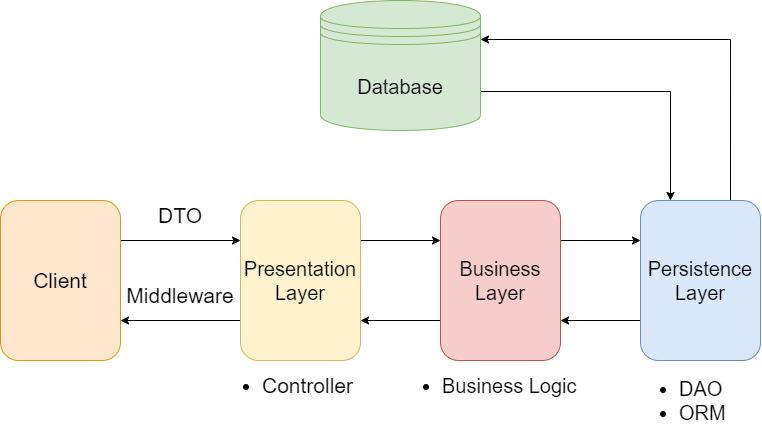
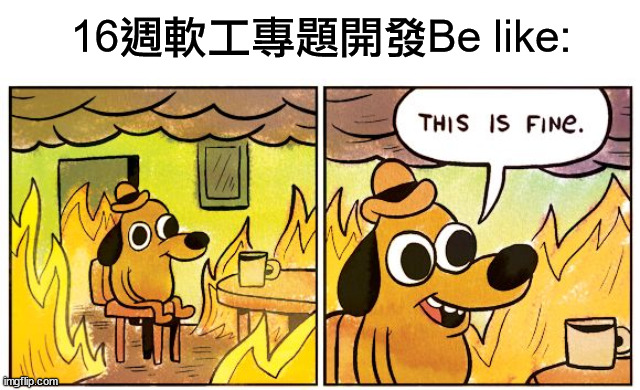

> 此文同步發表於[Medium](https://corgi-creeperjong.medium.com/)
>
> 因為Medium那邊是以公司名義發的文，所以比較官腔一些

嗨囉大家好！我是柯基。目前是資工系大三的學生，並在APPX時賦科技擔任非常菜的後端實習生。

這篇文章要來分享我這半個月來在時賦科技擔任後端實習生的心得及所學，並聊聊各種心路歷程～

### 起源 - 進入時賦

這一切的起源，要追溯回大二升大三那年暑假。

約莫大二下學期期中考前後，系上的教授籌備了一項實習媒合計畫，旨在與各大科技公司合作，為系上學生謀取實習機會並協助投遞履歷。看到這項計畫後，我和同學三五成群一起加入，參與了各個合作公司的面試及考核。

然而，因為開發經驗不足，加上應徵態度不夠積極，最後同學們都找到工作了，我卻一份都沒有找到，暑假就這樣泡湯了。「我的暑假只想拿來學習啊」當下滿腦都是這樣的念頭（但暑假還是玩得很開心）。

在大三上學期，我修了系上一門遠近馳名的課「**軟體工程**」，在近20人的團隊中，以Ruby on Rails開發後端API，並與前端串接完成了一個完整的專案。藉著這次的經驗與衝勁，我立志在隔年找一份後端的學年實習，以補回我暑假的缺憾。於是，我抱著我單薄卻充滿心意的履歷來到了時賦科技，並成功得到了賞賜，我的實習之路便就此開始了！


### 介紹－關於時賦科技

> 時賦科技團隊創立於民國103年 ，從事電腦軟體服務業，執行過許多大大小小專案，擁有豐富的專案實戰經驗，累積了許多domain knowledge以及不同領域的合作夥伴。
> 
> 為了提供人才更多的機會，時賦科技開始耕耘教育，期望將程式專業教育與業界實務結合，豐富的專案經驗與經營團隊的背景，使程式教育更加有競爭力，且為業界所認可。
> 
> 時賦在做的事：
>
> * 軟體客製化開發
>
> * APP應用軟體開發
>
> * APP UI/UX 設計
>
> * 資料庫設計規劃與調校
>
> * 軟體雲端服務架構規劃
> 
> － 擷取自時賦科技官方網站

在時賦科技中，開發大多採用前後端分離，並主要使用C# .NET、Java及Node.js作為開發語言。並且，不定期舉辦講座及課程，期望能培育更多人才。

### 初來乍到－Rails to .NET

在講心得以前，先來帶點技術層面的東西吧。

第一天到公司，把一些例行的報到手續給辦完之後，我的主管Jim就派了一份C# .NET CRUD的小專案給我作為練習。在寫的過程中，慢慢的回想起C#的語法，也漸漸熟悉系統架構及一些在.NET常用的Coding convention，下面請聽我娓娓道來。

由於在寫Ruby on Rails的同個學期裡，我也同時有在寫C#，雖然內容僅限於Windows Form，但物件導向的概念也算是有帶過一遍。即使如此，在時賦實習所用到的系統架構是與先前截然不同的（雖然關聯性不高但還是提及一下[第二專案效應](https://zh.wikipedia.org/zh-tw/%E7%AC%AC%E4%BA%8C%E7%B3%BB%E7%B5%B1%E6%95%88%E6%87%89)，適合用來警惕和我一樣的新手開發者）。

先前在使用Rails開發時採用的是MVC架構，而由於後端是Api-only，因此View component幾乎被捨棄，加上後端小組內成員幾乎都是第一次接觸開發，導致**整支專案的相關邏輯幾乎都寫在Controller裡，看起來十分凌亂且難以維護**。

而我在.NET下練習CRUD開發時，所採用的系統架構如下圖所示：



* Client

客戶端。後端開發時通常使用微軟支援的Swagger套件來對Web API進行測試，Postman則是作為輔助方案。

* Presentation Layer

表現層。對於客戶端對API發送的請求，會依據其RESTful的架構被轉發 (Route) 到此處，因此此層有許多Controller，分別處理不同集合的API。此外，有關用戶的身分驗證及簡單的Json conversion也會在此層完成。

* Business Layer

業務層。此層主要儲存商業邏輯，包括資料驗證及授權等等。針對一個資料主體會對應到一個Service，代表對此主體的所有功能及操作，最後再經由Controller對主體呼叫對應的服務。

> 表現層與業務層間的分工相對其它較不明顯。只要屬於邏輯的部分，皆可歸類至業務層中。然而，過度封裝會造成程式碼不直觀，難以維護，封裝不妥則可能導致重造輪子或程式碼冗長，該如何妥善的分類並封裝商業邏輯，達到簡潔而有效率的地步，取決於開發者的經驗與判斷。

* Persistence Layer

持久層。此層主要負責與資料庫互動的相關邏輯，並且僅能透過此層對資料庫進行CRUD操作。在此又使用DAO和ORM作為實現方法，下面會再提到。

大致的架構介紹完了，來講一下一些實作會用到的結構。

* DTO (Data Transfer Object)

數據傳輸對象。在接收及發送請求時，經常會需要預設或取得請求內Payload或Parameters的內容，此時可以宣告一個物件，負責攜帶需要傳遞的參數或其它內容，為客戶端及應用層提供資料傳輸的介面。不僅可以統一資料回傳格式（見註解），在開發時也可以使用各種好用的泛型函式，對資料的處理得以更加彈性。

> 註：此處僅是統一回傳**資料主體的格式（如ID, Name, Email等等的屬性）**，並非指整個回傳Payload的格式。

* Middleware

中介軟體。在Controller接收請求及回傳回應前，有一系列處理特定目的的程式，稱為Middleware。Middleware 呼叫的方式為LIFO (Last-In-First-Out)，接收請求時優先處理的，回應時就必須最後執行。在此實際的應用則是統一回傳格式如下，前端串接時才能有統一的介面接收API的回應。

```json
{
    IsSuccess: bool,
    SysMsg: string,
    Data: object
}
```

* DAO (Data Access Object)

資料存取物件。與DTO類似，在此是為應用層及資料庫提供資料主體存取的統一介面，內容則對映資料庫的各欄位、相關限制及相互關聯性。應用層可透過DAO存取資料庫的內容，而不需暴露資料庫的實際內容與細節。

* ORM (Object Relational Mapping)

物件關聯對映。在實作DAO的過程中，為了抽象化對資料庫的操作，ORM 將物件對映到資料庫的各個欄位，提供使用者以物件導向的方式修改資料庫的內容。以C# .NET Entity Framework Core為例，若使用原生語法對資料庫進行Query，程式碼如下：

```SQL
SELECT * FROM Users; # 查詢
INSERT INTO Users VALUES ('柯基', 'corgi'); # 新增
UPDATE Users SET Name = '柯基基' WHERE Name = '柯基'; # 更新
DELETE FROM Users WHERE Name = '柯基基'; # 刪除
```

對應的EF Core語法如下：

```C#
db.Users.ToList(); // 查詢
db.Add(new User{Name = '柯基', Uid= 'corgi'}); // 新增
var user = db.Users.Single(u => u.Name == '柯基'); // 更新
user.Name = '柯基基';
db.Remove(user); // 刪除
db.SaveChanges();
```

ORM 有以下優點：

1. 操作簡單直覺。透過物件導向的方式對資料庫進行操作，比起直接進行SQL Query來得更加直覺明瞭。

2. 安全。所有對資料庫的操作皆需透過ORM，而非直接Query，因此可以防止如SQL injection等資料庫存取上的資安疑慮。

3. 泛用於各種資料庫。當提供服務的資料庫引擎有更動時，僅需更改使用的套件，在寫法上不需做太大的更動。若使用傳統的存取方法，則需逐一修改Query語法。

除了以上的架構與技術，我也學到了C# .NET中一些好用的套件及技巧。

* 依賴注入 (Dependency Injection)

透過將架構中各個Component使用Interface抽象化，再將Interface及其實作逐一註冊進DI容器中，即可在建構需要下一層方法的物件時，直接從DI容器中取得Interface並提供給物件使用其方法，解決層與層之間強耦合的情況。

* AutoMapper

使用套件處理建構物件或物件型別轉換時，需傳入多個參數進入建構式，導致程式難以維護的問題。

以上就是我這半個月內學到關於C# .NET的技術與開發架構，有些是先備知識，也有很多是新學的東西，雖然理解和使用上沒遇到太大的問題，但也是查了不少文件，也求救了好幾次Orz。感謝主管Jim和另一位實習生Tom一直幫我解決問題。

### 經驗值上升－至今感受到的差別

講完技術類的東西，可以來談談經驗和心得感想了。

目前在時賦雖然只有半個月不到，也還沒進入到真正的專案中，但至今學到的東西，感受上已經接近學校內一學期可以學到的東西了，所學的新知及感受良多啊。

在我看來，實習時所接觸的開發跟在學校接觸的有以下差別：

* 程式品質的差別

正如我前面所提，先前在學校所開發的專案，由於大部分後端成員都是第一次接觸開發，系統並沒有嚴謹的架構，加上配合課程進度而被壓縮的開發時程，也沒有在執行效率、可維護性和可讀性上下太多工夫，現在回頭看看之前寫的Source code，真的是不敢恭維。



在實習時練習的專案中，不僅要遵守前面所提及的架構去開發功能，善用各種套件及工具來完善系統的可維護性，還要時時Review自己的Code是否缺乏效率或難以閱讀，雖然這是自己平常寫Code就有的習慣，但在實習期間，又需更加重視這樣的要求。

* Troubleshooting的能力

在學校開發時，因為時常會有和同學吃飯閒聊，或在別堂課遇到的機會，因此有很多機會可以討論在開發上遇到的問題，甚至現場電腦拿出來就可以解決。相較於實習期間，由於公司裡每個人每天都有要完成的進度，也有時程上的壓力，因此比起在學校，有更多問題都要靠自己積極解決，使用Debugger、手動偵錯、爬文及查文件的能力也需隨之提升。

* 維持效率的方法

實習期間不同於在學校開發，是一天長達八小時的開發時數，為了維持良好的效率，除了一定的自制力以外，時賦也給予我們很多監督自己或恢復活力的機會：

1. Daily sync

每天早上，所有人都會聚在一起，報告今天在哪個專案預計要完成哪些進度，這不僅僅是告知負責同個專案的人，更是告訴自己今天必須完成什麼項目，日後也方便回顧自己是否在某個項目花了太多時間，並加以檢討改進！

2. RD Sharing

專屬於RD部門的分享時間！每周我們都會找一個固定的時間，分享這週做了什麼事？遇到了什麼困難？怎麼解決？或是一起討論有什麼解決方法，檢討彼此的做法是否有疏漏等等。這個時間不但可以檢討自己的程式，得到解答或找到問題的頭緒，更可以從別人的經驗中學得新東西或新觀點，對開發上有莫大的幫助，是我個人很喜歡的時間！

3. 下午茶時間

公司不定期舉辦的享樂時間！在這時候，大家可以揪團點自己喜歡的飲料或甜點，等外送送到後，便可稍作休息，讓腦袋放空一下。當然，休息不是為了不要走路，是為了走更長遠的路，在這之後，我通常會起來走一走，回想一下剛才遇到的問題，或Review一下Code，此時再配一杯咖啡，思緒清晰許多，很多問題就能迎刃而解，對接下來的工作也會更有效率！


### 結語 - 心得與未來展望

這是我人生第一個實習，很慶幸來到了時賦。在這之前，我並沒有接觸過實際業界開發的流程或模式，總是希望能找到一個「可以帶走學校學不到的東西」的實習職位。確定加入時賦後，也是會偶爾擔心實習是否只是打雜，到最後可能什麼都沒學到。慶幸的是，這些擔憂都沒有發生。

在時賦的這半個月，我幾乎每天都能學到新東西，且能充分感受的到每個人都是一起奮鬥的夥伴，彼此互相幫助及砥礪，沒有所謂的上下階級之分。在這樣的環境下成長，是非常充實且滿足的，很感謝時賦的大家長FRank願意給我這個機會。

在未來的實習生涯裡，我期許自己能早點熟悉開發，早日做足準備後步入正式專案，汲取更多實戰經驗，並學習更多新技術，涉略更多領域，最後，希望能找時間把這些所學都記錄下來，對於起初實習的所抱有的期待，也能算是如願以償了！