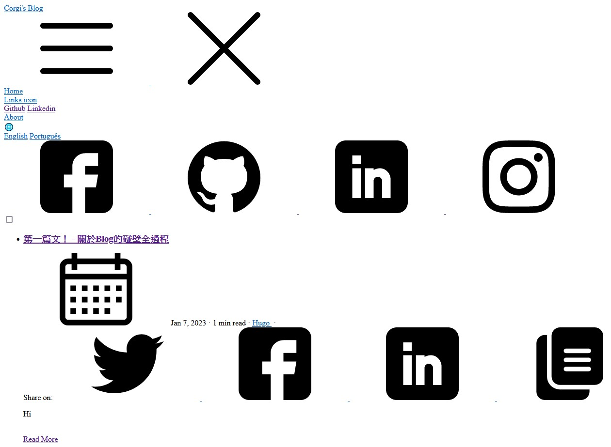

終於可以寫文了，我的天。

先講一下事情的來龍去脈，和這個Blog的出生過程好了。

### 起源

看了一下放Blog資料的修改紀錄，最早在2022/5/20就有這個Blog了。

當初看到很多人都有自己的Blog，上面可以放自己的學習心得或記錄，覺得蠻酷的？
加上當初為了找實習，希望能迅速拉個自己的Blog，再隨便丟幾篇文上去，改改日期就可以拿來充數了。

結果呢，可想而知沒那麼順利，光是選主題我就猶豫了老半天，這個下面再說。

我選擇的框架是[Hugo](https://gohugo.io/)。Hugo是一個使用Golang開發的開源網站框架，旨在生成靜態的網頁，詳細介紹可以自己去Hugo的官網看，因為我也只知道這些。另外還有一個框架叫[Hexo](https://hexo.io/zh-tw/)，使用Node.js開發，也同樣是生成靜態網頁的框架。

至於為何選擇Hugo，純粹是因為身邊比較多人用而已，呵呵。

### 主題

[這裡](https://themes.gohugo.io/)是Hugo官網目前的所有主題，
第一次進去看到光是Blog標籤就有200多個，我整個心都涼了，身為一個嚴重選擇困難的人，可能選到我畢業都還沒選完。

於是呢，我幫自己列了幾點需求，至少找起來快多了。

* Blog
* Responsive
* Dark mode (資工肥宅一定要的吧)
* 主頁面有最新文章列表
* 側欄有個人簡介及Tag
* UI簡單美觀

綜合以上所有條件，和我傑出的猶豫能力，我選擇了你們現在看到的這個主題[Clarity](https://github.com/chipzoller/hugo-clarity)。

其實挑主題這件事也不是Tag按一按就結束的。像Clarity這個主題的Tag只有`Blog`和`Dark`，它有做響應式，但也完全沒放`Responsive`，
更別說後面三點你要列Tag也不知道打什麼的特色，所以在每個都點進去看範例的情況下，我大概選了快一整天。

我知道這是一個非常爛大街的主題（應該），但至少他有符合我上面的需求，用起來還算蠻愉悅的，希望大家也看得愉悅。

（其實我根本不知道會不會有人來看，主要是打給自己記錄用）

### 架設

架設初步都是非常快樂的，跟著github上的README走就完成80%了。我這裡不打算一步一步講，因為那不是重點。

簡而言之，他提供了三種作法。

1. 使用GitPod或Clone下來開Hugo server

這個作法是給想開源貢獻或只想載下來玩看看的人，不適合要架設Blog的人。

2. 使用Hugo modules

據說是最快且最好維護的方法，當然選這個啊，哪次不選了。

3. 使用Git submodules

使用比較老的方式維護主題的repo。

我使用的是第二個方法，做法在github上都有，這裡一樣略過。

值得一提的是2和3的作法。由於Hugo本身的repo和主題的repo是分開的，因此無法用單一的repo統一管理。
這裡的Hugo module的解法就用類似套件管理的方式管理主題的repo，
至於git submodule是在沒有Hugo的情況下，可以使用submodule在你的repo下分割出一個子repo，
讓你主題的repo可以在此管理更新。

上面步驟都做完後，就可以用`hugo server`在本機瀏覽了，日後也可以測試文章內容。

> `hugo server`後可接一些Flag，這裡介紹一些我比較常用的
>
> `-D` 連同文章草稿一起顯示
>
> `-F` 連同未來文章一起顯示

### 部署

本機測試成功後，就可以準備部署到網站上了。

這裡使用Github Pages來部署網站，詳細教學網路上搜也是滿地都是，這裡不贅述。

比較值得一提的是CI/CD的部分，這裡使用了Github Actions來處理，讓每次Push完後，網站都能自動部署上去。

在你`[Username].github.io`的repo中Action > New workflow > Simple workflow Configure，新增一個叫`hugo_publish.yml`的workflow，
內容如下（請根據需求更改內容）：
```yml
name: github pages

on:
  push:
    branches:    
      - main
    paths: ["content/**", ".github/workflows/hugo_publish.yml", "config/**", "layouts/**", "static/**"]

jobs:
  deploy:
    runs-on: ubuntu-20.04
    steps:
      - uses: actions/checkout@v2
        with:
          submodules: true  # Fetch Hugo themes (true OR recursive)
          fetch-depth: 0    # Fetch all history for .GitInfo and .Lastmod

      - name: Setup Hugo
        uses: peaceiris/actions-hugo@v2
        with:
          hugo-version: '0.99.1'
          extended: true

      - name: Build
        run: hugo --minify

      - name: Deploy
        uses: peaceiris/actions-gh-pages@v3
        with:
          github_token: ${{ secrets.GITHUB_TOKEN }}
          publish_dir: ./public
          cname: 'blog.corgicreeperjong.tk'
```

最後一行的cname是自定義網域的部分，如果沒有就不需要填。自定義網域的方式是先找一個免費的Domain name（你有錢也可以買一個），
再用Cloudflare去設定代理github.io，結果就會如你現在所看到的，不是github的域名，但是確確實實的host在github上。

> 2023/2/10 更新
> 
> 昨天公司RD sharing講到Cloudflare，我說我只拿來做redirect，
> 被罵殺雞用牛刀了QQ我找機會會來好好研究的

我這裡也打算略過詳細的做法，這篇主要是要記錄自己踩坑的紀錄，就沒打算寫太細了。
（其實還有一部份原因是忘記了，這些東西都是半年前找同學求助弄好的，早就忘光了）

接著，在Settings > Pages裡，設定Source為Deploy from a branch，
底下的Branch設定為`gh-pages`，如果你有自訂網域，記得要填在Custom Domain裡。
最後，把最下面的Enforce HTTPS打開，除非你的網域不支援HTTPS。

以上都設定好後，就可以Push上去看看成果了。

### 碰上大岩壁

由於本身沒什麼架網站的經驗，所以真的是東牆補西牆，然後四處求救，真的要好好檢討一下。

也是因為這樣，我一個設定沒寫好，就找了一個月，下面請聽我娓娓道來。

當我完成上面的部署後，很開心的在瀏覽器輸入[blog.corgicreeperjong.tk](https://blog.corgicreeperjong.tk/)，想看看成果。
結果呢，他給我這個鬼東西



然後呢，就沒有然後了。

我在發現這個Bug後的一個月，四處爬文四處問，雖然沒有問得很積極，但也是煩惱我不久。明明Local測都可以，為什麼部署上去就壞掉了呢？

於是有一天，我趁有空的時候問了一下子權（aka Subarya），因為他也是用Hugo架站，我們試著把他的repo clone下來對比，依舊沒發現什麼端倪。

直到子權幫我查到了這個...

```toml
# set `baseurl` to your root domain
# if you set it to "/" share icons won't work properly on production
baseurl = "/"  # Include trailing slash
```

然後我再看一下我的`config/_default/config.toml`

```toml
baseurl = "blog.corgicreeperjong.tk"
```

嗯...我看到root domain就寫了自定義的domain，結果寫一個slash就完事了。解決這個問題之後，子權便跟我說：

「太棒了，那你之後發你的第一篇文了，通常第一篇都是記錄自己架設Blog的整個過程，你應該有很多東西可以寫，哈哈哈。」

當下很開心，想回家就開始寫第一篇文，記錄我這一個月來（其實好像不只）的心血，結果那時候剛好適逢系上資工營的行前營，
加上暑假一到就跑去補習班當輔導老師（嗯對，我那年暑假沒找到實習），所以根本忘了這回事。

直到最近，這件事又重回到我的To-do list裡面，至於到發出這篇文前又發生了什麼，我們下面繼續連載。

### 重新連載

最近學校放寒假了，16周雖然有點累，但放假後真的很爽。我這段期間找了份實習，主要是寫C#，
也就是因為這份實習剛開始真的學到太多東西了，迫不及待把這些知識記下來。於是，我就來繼續來弄這個東東了。

當然啦，半年前的config沒有設定完全，還是踩了一些坑。

先來講一下**時區**的問題，Hugo對於文章日期的處理還算是好用。每篇文章的最上面會有一區用`---`或`+++`框住的參數區，
這裡稱為`page variables`，顧名思義，就是針對每篇文章的configuration，包括`title`、`description`等等。

{}

若使用`---`，請用以下格式

```toml
[variable_name]: [value]
```

若使用`+++`，請用以下格式

```toml
[variable_name] = [value]
```

{}

其中，`date`可以指定發文日期，格式為`YYYY-MM-DD`，值得注意的是，Hugo只會顯示當前日期以前的文章，
也就是說，你可以設定一篇文章的發文日期在未來的某一天，就可以達成排程發文的功能，雖然我暫時想不到什麼時候會用到就是了。

發文日期到此還沒結束，當你設定好後很開心地輸入`hugo server`，想看自己文章的排版如何，結果卻還是一片黑或一片白，啥都沒有。

這個時候十之八九就是時區的問題了，Hugo預設的時區都是`UTC+0`，所以假設我在台北時間2023-01-01 01:00設定了`date: 2023-01-01`，
但其實Hugo認定目前的時間是`UTC+0`，也就是2022-12-31 17:00，時間還沒到，自然無法顯示文章。

解決的方法也很簡單，在`config.toml`中加入這行

```
timeZone = "Asia/Taipei"
```

就可以把時區調到臺北，行為就會合理了。

還有一點比較瑣碎。主頁面上方原本有個Archive的標籤，現在暫時被我取消了。原先在exampleSite看到的時候，
以為是跟別人Blog上的Archive一樣，可以封存自己不想放在主頁的文章（之類的）。

直到後來經過一番摸索，看到了他的config

```toml
[[main]]
  name = "Archives" # 標籤名稱
  url = "post/rich-content/" # 轉向url
  weight = -109 # 標籤位置，自行摸索
```

...只是一個捷徑而已。

但也算是好用？之後或許可以試試看讓`url`導向到主頁以外的文章列表，就可以達成真正Archive的效果了。

> 這裡順便統整一下幾個常用的page variables
> 
> `author`: 作者
> 
> `title`: 文章標題
>
> `summary`: 文章列表中呈現的文章敘述
>
> `date`: 發布日期
> 
> `draft`: 是否為草稿
>
> `toc`: 是否在開頭加上目錄（Table of contents）
>
> `slug`: 自訂url
>
> `aliases`: url別名（會重新導向至預設或自訂url）
>
> `usePageBundles`: 使用Bundle管理文章（詳見[這裡](https://gohugo.io/content-management/page-bundles/)）
> 
> `thumbnail`: 文章縮圖
> 
> `categories`, `tags`, `series`: 分類用的標籤
> 
> `featured`: 是否為精選文章（可設定置頂或放於側欄）

### 未來展望

其實在寫這篇的同時，我也發現了很多還不知道怎麼設定的feature，或是不滿意的地方

* 閱讀時間不準確
* i18n設置
* markdown樣式不如預期
* 前面提到的Archive功能
* 不知道可不可以開留言功能？

這篇裡面因為主要給自己記錄用，所以也忽略了很多沒踩坑的細節，config的設置尤其多...
主要是希望自己以後還是能養成看文件的習慣啦，就忽略了很多文件有寫的東西。

如果真的有人吃飽沒事幹看到這邊，也希望可以不吝給一下意見，包括文章內容或Blog設置等等的。

最後放一下兩位幫助我架站的好同學的架站文和Blog，大家如果真的要技術一點的文章可以去這邊看。

{}

快速建立Hugo Blog

[Hugo-01：建立一個Hugo Blog](https://blog.smallten.me/p/hugo-01/)

幫我找baseUrl Bug的子權（Subarya）的部落格

[Subarya](https://kutsunasubarya.github.io/)

{}

下一篇高機率發C#，也有可能繼續改Blog，希望不要半途而廢。